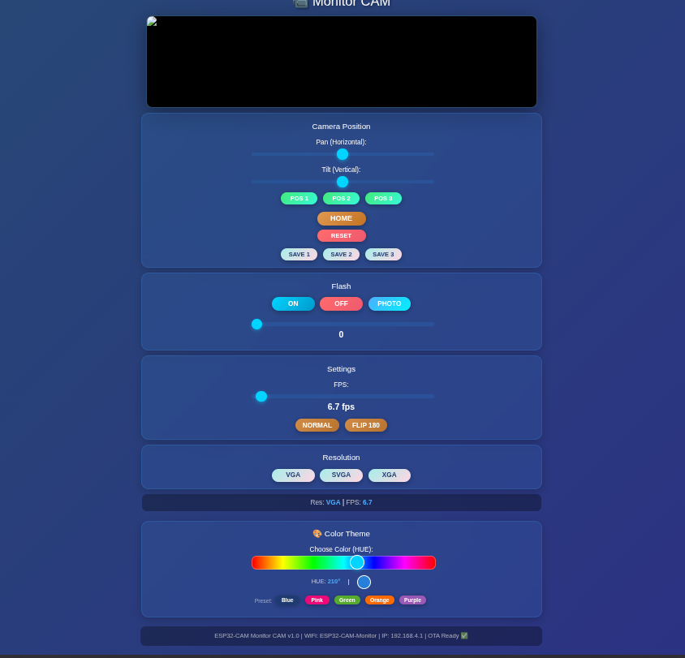
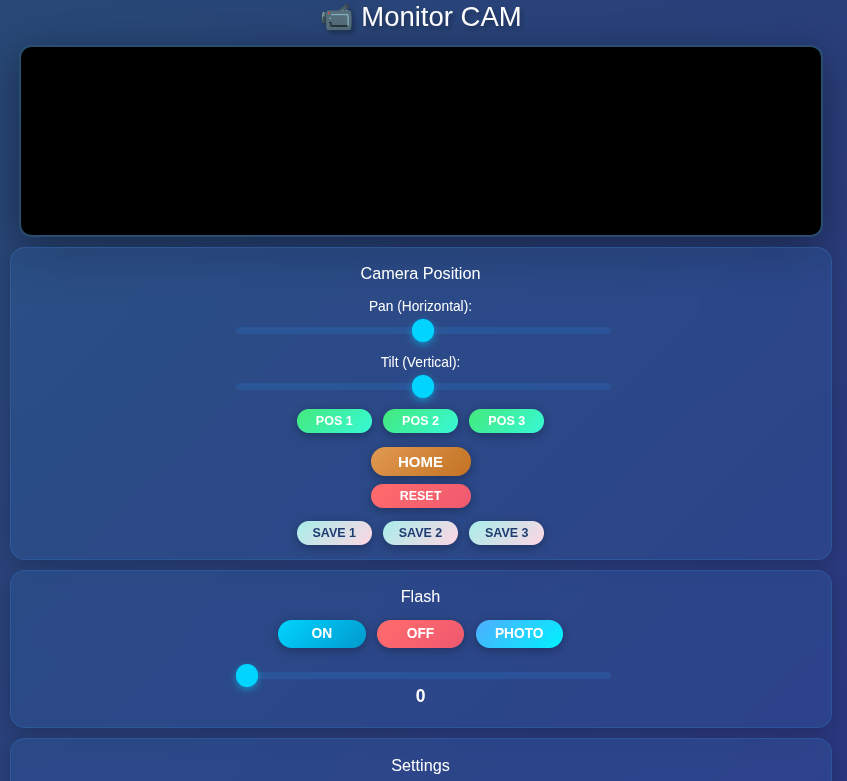
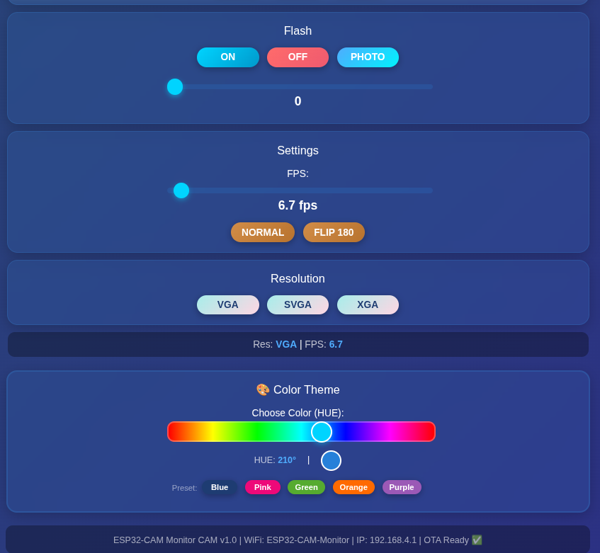

# 📹 ESP32-CAM Smart Guardian RobotCam

<p align="center">
  
  
</p>

<p align="center">
  
  
  
  
  
</p>

---

## 📖 Description

**Smart Guardian RobotCam** is a complete and professional video surveillance system based on ESP32-CAM, designed to security monitor with remote pan/tilt control via positional servo motors.

> **Development Note:** This project was developed with the assistance of **Claude Sonnet 4.5** by Anthropic, an AI assistant that helped with code optimization, documentation, and troubleshooting throughout the development process.

### ✨ Main Features

- 📹 **Live video streaming** with configurable resolution (QVGA - UXGA)
- 🎮 **Pan/tilt servo control** with sliders (0-180°)
- 💾 **3 preset positions** saveable with RESET button
- 🎨 **HUE color picker** customizable with EEPROM memory
- 📱 **Installable PWA** as native app on smartphones
- 🔄 **OTA Updates** for wireless firmware updates
- 🖼️ **Fullscreen mode** with double click
- 💡 **Flash LED** with PWM brightness control
- 📊 **OLED display** for status information
- 🌐 **Built-in WiFi Access Point**

---

## 🎯 Why This Project?

Secure, low-cost indoor surveillance camera for monitoring children from another room, streaming locally through an ESP32 private Wi-Fi network with no external data transmission:
- ✅ Complete control of framing without physically moving the device
- ✅ Save favorite positions (crib, door, play area)
- ✅ Responsive web interface accessible from any device
- ✅ OTA firmware updates without disassembling the device
- ✅ Complete aesthetic customization

---

## 🛠️ Required Hardware

| Component | Specifications | Quantity | Notes |
|-----------|---------------|----------|-------|
| **ESP32-CAM** | AI-Thinker with OV2640/OV3660 | 1 | Main module |
| **Positional Servos** | MG90S or Miuzei Metal Gear 180° | 2 | ⚠️ **MUST be positional, NOT continuous!** |
| **OLED Display** | SSD1306 128x64 I2C | 1 | Optional but recommended |
| **Power Supply** | 5V 2A+ | 1 | ⚠️ **External power mandatory for servos** |
| **Jumper Wires** | Male-Female | - | For connections |
| **Pan/Tilt Mount** | Servo mechanical support | 1 | 3D printable (see `3D_Print` folder) |

### 📐 3D Printed Parts Availability

**3D printable STL files** for the pan/tilt mount are available in the `3D_Print/` folder.

> **Note:** Original source files (CAD models) for 3D parts are available upon request but are not included in the repository as they are hobby-grade designs, not professionally engineered. If you need them for modificaSmart_Guardian_RobotCamtions or custom adaptations, feel free to open an issue or contact the maintainer.

### ⚠️ IMPORTANT: Positional vs Continuous Servos

This project requires **POSITIONAL servos** (0-180°), NOT continuous rotation servos!

**How to verify:**
- ✅ **Positional**: Move to a specific angle and stop
- ❌ **Continuous**: Rotate continuously like motors

**Recommended servos:**
- Miuzei 9g Servo Metal Gear (180°, 6V)
- TowerPro MG90S
- Any servo with 0-180° range

---

## 📐 Wiring Diagram
(see `Wiring` folder) 

### ESP32-CAM Pinout

| ESP32-CAM Pin | Component | Note |
|---------------|-----------|------|
| **GPIO 12** | Pan Servo (Horizontal) | PWM Signal |
| **GPIO 13** | Tilt Servo (Vertical) | PWM Signal |
| **GPIO 14** | OLED SDA | I2C Data |
| **GPIO 15** | OLED SCL | I2C Clock |
| **GPIO 4** | Flash LED | PWM |
| **5V** | ⚠️ **External servo power** | DO NOT power servos from ESP32! |
| **GND** | Common ground | All GNDs connected together |

### ⚡ Power Supply

```
5V 2A Power Supply
    │
    ├─── ESP32-CAM (5V)
    ├─── Pan Servo (5V + GND)
    ├─── Tilt Servo (5V + GND)
    └─── OLED (3.3V/5V + GND)
```

**NOTE:** MG90S servos also work at 5V with slightly reduced torque (designed for 6V).

---

## 💻 Software and Libraries

### Software Requirements

- **Arduino IDE** 1.8.19 or higher (or Arduino IDE 2.x)
- **ESP32 Board Support** 2.0.x or higher
- **CH340 Driver** (for USB programming)

### Required Libraries

Install via Arduino Library Manager:

| Library | Version | Purpose |
|---------|---------|---------|
| **ESP32Servo** | 0.13.0+ | Servo motor control |
| **Adafruit GFX Library** | 1.11.x | OLED graphics |
| **Adafruit SSD1306** | 2.5.x | OLED driver |
| **ArduinoOTA** | Included in ESP32 Core | Wireless updates |

**ESP32 Board Installation:**

1. Arduino IDE → File → Preferences
2. Additional Board Manager URLs: 
   ```
   https://espressif.github.io/arduino-esp32/package_esp32_index.json
   ```
3. Tools → Board → Board Manager → Search "ESP32" → Install

---

## 🚀 Installation and Configuration

### 1️⃣ Arduino IDE Configuration

**Board Settings:**
- **Board**: "AI Thinker ESP32-CAM"
- **Upload Speed**: 115200
- **Flash Frequency**: 80MHz
- **Partition Scheme**: "Minimal SPIFFS (1.9MB APP with OTA)"
- **Core Debug Level**: "None"

### 2️⃣ Firmware Upload

**First time (via USB):**

1. Connect FTDI/USB programmer to ESP32-CAM
2. **Connect GPIO 0 to GND** (boot mode)
3. Open `Source_Code/ESP32_robot_cam/ESP32_robot_cam.ino`
4. Modify WiFi credentials (if needed):
   ```cpp
   const char* ssid = "ESP32-CAM-Monitor";     // WiFi SSID
   const char* password = "12345678";           // WiFi Password
   const char* ota_password = "12345678";       // OTA Password
   ```
5. Click **Upload**
6. **Disconnect GPIO 0 from GND** after upload
7. Press RESET

### 3️⃣ Servo Limits Configuration

⚠️ **IMPORTANT:** Adjust angle limits to prevent cable tangling!

In the `.ino` file, modify:

```cpp
// Servo angle limits (ADJUST to prevent cable tangling!)
#define PAN_MIN_ANGLE     0       // Left limit (default 0°)
#define PAN_MAX_ANGLE     180     // Right limit (default 180°)

#define TILT_MIN_ANGLE    0       // Down limit (default 0°)
#define TILT_MAX_ANGLE    180     // Up limit (default 180°)
```

**Example restricted limits:**
```cpp
#define PAN_MIN_ANGLE     30      // Avoid cables on left
#define PAN_MAX_ANGLE     150     // Avoid cables on right
#define TILT_MIN_ANGLE    45      // Avoid cables downward
#define TILT_MAX_ANGLE    135     // Avoid cables upward
```

---

## 🎮 Usage

### WiFi Connection

1. Power on ESP32-CAM
2. OLED displays:
   ```
   WiFi: ESP32-CAM-Monitor
   Pass: 12345678
   IP: 192.168.4.1
   OTA: Monitor-CAM
   ```
3. Connect smartphone/PC to WiFi **ESP32-CAM-Monitor**
4. Password: **12345678**
5. Open browser: `http://192.168.4.1`

### Web Interface

<p align="center">
  
  
  
</p>

#### 📹 Camera Control

- **Double click on video** → Fullscreen mode
- **Pan Slider** → Horizontal movement (0-180°)
- **Tilt Slider** → Vertical movement (0-180°)

#### 💾 Preset Positions

```
[POS 1]  [POS 2]  [POS 3]    ← Recall saved position
        [HOME]                ← Return to 90°/90°
        [RESET]               ← Clear all presets
[SAVE 1] [SAVE 2] [SAVE 3]   ← Save current position
```

**How to use:**
1. Move camera with sliders to desired position
2. Click **SAVE 1** → Saves to memory
3. Click **POS 1** → Returns to saved position
4. **RESET** → Clears all presets (returns to 90°/90°)

Presets are saved in **EEPROM** and persist after reboot!

#### 💡 Flash LED

- **ON/OFF** → Turns LED on/off
- **Brightness slider** → Adjusts intensity (0-255)
- **PHOTO** → Downloads instant photo

#### 🎨 Color Theme

- **HUE Slider** → Changes theme color (0-360°)
- **Quick presets**: Blue, Pink, Green, Orange, Purple
- Automatically saved to EEPROM

#### ⚙️ Settings

- **FPS Slider** → Image refresh rate (1-10 fps)
- **NORMAL / FLIP 180** → Rotates image
- **Resolution**: VGA, SVGA, XGA

---

## 🔄 OTA Updates (Over-The-Air)

### First OTA Update

1. **Connect to WiFi** ESP32-CAM-Monitor
2. **Arduino IDE** → Tools → Port
3. You'll see: `Monitor-CAM at 192.168.4.1` ← Select this!
4. Modify code and click **Upload**
5. OTA Password: `12345678`
6. Serial Monitor shows progress

### Upload Monitoring

Watch **Serial Monitor (115200 baud):**
```
OTA Update Start - Type: sketch
OTA Progress: 15%
OTA Progress: 45%
OTA Progress: 98%
OTA Update Complete!
```

**OLED shows real-time progress!**

### ⚠️ OTA Troubleshooting

**Problem**: OTA doesn't appear in port list

**Solutions:**
1. Verify WiFi connection
2. Ping `192.168.4.1` must respond
3. Restart ESP32 (disconnect power)
4. Restart Arduino IDE
5. Firewall: add exception for Arduino

**For complete OTA guide:** See `AGGIORNAMENTO_OTA.txt`

---

## 📱 PWA (Progressive Web App)

The interface is installable as a **native app** on smartphones!

### Installation

**Android:**
1. Open `192.168.4.1` in Chrome
2. Menu → "Add to Home Screen"
3. "CAM Monitor" icon on home

**iOS:**
1. Open `192.168.4.1` in Safari
2. Tap "Share" → "Add to Home Screen"
3. "CAM Monitor" icon on home

**Desktop:**
1. Chrome shows banner "Install CAM Monitor"
2. Click "Install"
3. App in standalone mode

---

## 🎨 Customization

### Modify WiFi Credentials

In the `.ino` file:

```cpp
const char* ssid = "MyCamMonitor";           // Change SSID
const char* password = "SecurePassword";      // Change Password
```

### Modify OTA Password

```cpp
const char* ota_password = "Strong_OTA_Password";
```

⚠️ After changing OTA password, reload **via USB once**!

### Modify Movement Step

```cpp
#define PAN_STEP  2       // Degrees per click (default 2.5°)
#define TILT_STEP 2       // Smaller = finer movement
```

### Change Default Theme

```cpp
int savedHue = 340;  // 210=Blue, 340=Pink, 120=Green, 30=Orange, 280=Purple
```

---

## 🐛 Troubleshooting

### Problem: Camera doesn't power on

**Causes:**
- Insufficient power (needs 5V 2A)
- Damaged micro-USB cable
- FTDI programmer connected (disconnect it!)

**Solution:**
- Use external 5V 2A power supply
- Disconnect programmer after upload
- Verify red LED on ESP32-CAM is lit

---

### Problem: Servos don't move

**Causes:**
- Servos powered from ESP32 (NO! needs external power)
- Continuous rotation servos instead of positional
- GND not common

**Solution:**
- Power servos from external 5V supply
- Verify servos are **positional** (0-180°)
- Connect all GNDs together

---

### Problem: Blurry or dark image

**Causes:**
- Camera focus not adjusted
- Flash LED off
- Resolution too high

**Solution:**
- Rotate camera lens for focus
- Turn on flash LED and adjust brightness
- Reduce resolution to VGA/SVGA

---

### Problem: OTA fails

**Causes:**
- Insufficient flash memory
- Unstable WiFi connection
- Firewall blocking port

**Solution:**
- Verify sketch < 50% memory (see compiler)
- Move device closer to PC/router
- Temporarily disable firewall

**Complete guide:** `AGGIORNAMENTO_OTA.txt`

---

## 📂 Repository Structure

```
Smart_Guardian_RobotCam/
│
├── Source_Code/
│   ├── Browser_Interface_HTML
│   └── ESP32_robot_cam
│   │     └── ESP32_robot_cam.ino                 # Main firmware
│   └── Update_By_OTA.txt                         # OTA update deep dive (Italian)
│   
├── 3D_Print/
│   └── *.3mf                                     # 3D printable servo mount
│
├── Wiring/
│   ├── Wiring.png                               # Wiring diagram
│
├── Images/
│   ├── Components                               # Hardware components images
│   ├── Robot_Cam                                # Hardware assembly photo
│   └── ...
│
├── Browser_Interface_Images/
│   ├── *.png                   # UI overview
│   └── ...
│
├── Video/
│   ├── *.mp4                                 # Demonstration video
│   └── ...
│
├── README.md                                    # This file
└── LICENSE                                      # MIT License
```

---

## 🤝 Contributing

**Contributions are welcome!** Everyone can contribute to improve this project.

Whether you're fixing bugs, adding features, improving documentation, or sharing your customizations, your help is appreciated!

### How to Contribute

For major changes, please:

1. Fork the repository
2. Create feature branch (`git checkout -b feature/NewFeature`)
3. Commit changes (`git commit -m 'Add NewFeature'`)
4. Push to branch (`git push origin feature/NewFeature`)
5. Open Pull Request

### Areas for Contribution

- 🐛 Bug fixes and issue resolutions
- ✨ New features and enhancements
- 📚 Documentation improvements
- 🌍 Translations to other languages
- 🎨 UI/UX improvements
- 🔧 Hardware variations and alternatives
- 📊 Testing and quality assurance

All skill levels are welcome! Don't hesitate to open issues for questions or suggestions.

---

## 🔧 Development

### Development Tools

This project was developed using:
- **Arduino IDE** for ESP32 programming
- **Claude Sonnet 4.5** by Anthropic for code assistance and optimization
- **Git** for version control

---

## 📄 License

This project is released under **MIT License**.

```
MIT License

Copyright (c) 2025 [Your Name]

Permission is hereby granted, free of charge, to any person obtaining a copy
of this software and associated documentation files (the "Software"), to deal
in the Software without restriction, including without limitation the rights
to use, copy, modify, merge, publish, distribute, sublicense, and/or sell
copies of the Software, and to permit persons to whom the Software is
furnished to do so, subject to the following conditions:

The above copyright notice and this permission notice shall be included in all
copies or substantial portions of the Software.

THE SOFTWARE IS PROVIDED "AS IS", WITHOUT WARRANTY OF ANY KIND, EXPRESS OR
IMPLIED, INCLUDING BUT NOT LIMITED TO THE WARRANTIES OF MERCHANTABILITY,
FITNESS FOR A PARTICULAR PURPOSE AND NONINFRINGEMENT. IN NO EVENT SHALL THE
AUTHORS OR COPYRIGHT HOLDERS BE LIABLE FOR ANY CLAIM, DAMAGES OR OTHER
LIABILITY, WHETHER IN AN ACTION OF CONTRACT, TORT OR OTHERWISE, ARISING FROM,
OUT OF OR IN CONNECTION WITH THE SOFTWARE OR THE USE OR OTHER DEALINGS IN THE
SOFTWARE.
```

---

## 🙏 Acknowledgments

- **Espressif Systems** for ESP32 platform
- **Adafruit** for GFX and SSD1306 libraries
- **Kevin Harrington** for ESP32Servo library
- **Anthropic** for Claude Sonnet 4.5 AI assistant
- Arduino and ESP32 community for support

---

## 📊 Project Statistics

- **Flash Memory Used**: ~910KB (29%)
- **RAM Used**: ~52KB (16%)
- **HTTP Endpoints**: 16
- **Lines of Code**: ~850
- **OTA Support**: ✅ Yes
- **PWA Ready**: ✅ Yes

---

<p align="center">
  ⭐ If you like this project, please give it a star on GitHub! ⭐
</p>

<p align="center">
  <strong>Made with ❤️ for parents and makers</strong>
</p>

<p align="center">
  <em>Developed with assistance from Claude Sonnet 4.5 by Anthropic</em>
</p>

---

**Last updated:** 2025-02-29  
**Version:** 1.0.0  
**Compatibility:** ESP32-CAM AI-Thinker with OV2640/OV3660
